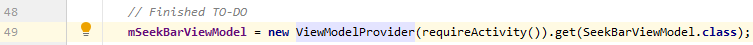
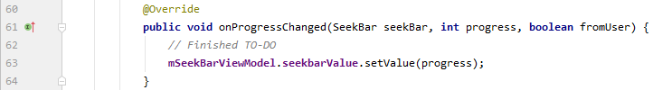
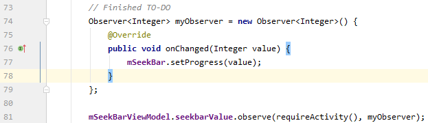
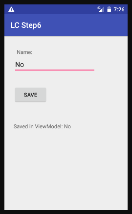
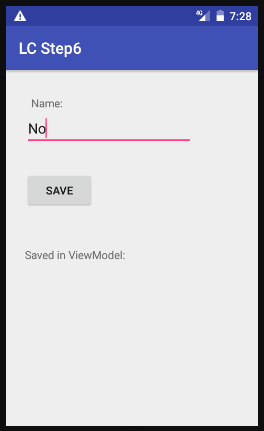
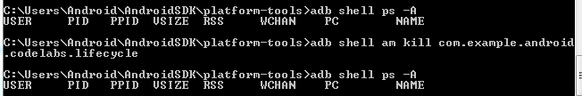
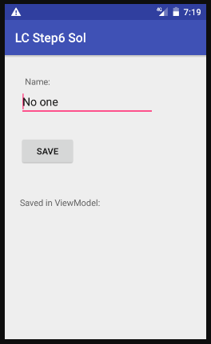
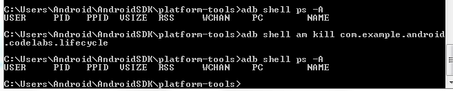
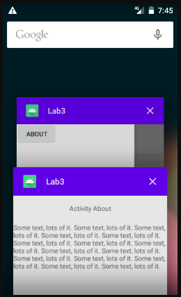
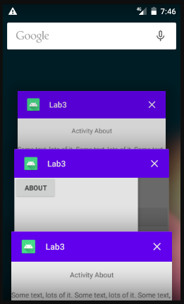

# Лабораторная работа №3. Activity Lifecycle. Alternative resources.
## Цели:
* Ознакомиться с методом обработки жизненного цикла activity/fragment при помощи Lifecycle-Aware компонентов.
* Изучить основные возможности навигации внутри приложения: создание новых activity, navigation graph.


## Задачи (19 вариант):
### Задача 1. Обработка жизненного цикла с помощью Lifecycle-Aware компонентов.
1ый и 2ой шаги codelabs чем-то напоминает предыдущую лабораторную работу. Я убедился, значение счётчика обновляется при повороте экрана в первом шаге и не обновляется во втором.

3ий шаг - после внесения требуемых изменений всё работает как и предполагается, в logcat каждую секунду выводится уведомление об апдейте таймера. Значение счётчика не не обновляется при повороте экрана.

4ый шаг - в logcat выводится информация о добавлении/удалении listener'а.

На 5ом шаге, наконец, дали задание писать код.
Первым делом, получаем экземпляр класса и привязываем его к нашему активити:



Далее, при изменеии значения слайдера изменяем значение ViewModel. В ответе есть проверка, прошло ли изменение от пользователя - у меня этой проверки нет, поскольку в этом задании других источников изменения прогресса (помимо пользователя) я не вижу.



Наконец, я создал Observer, и задал ему наблюдать за mSeekBarViewModel. В ответе предусмотрена проверка на Null, в моём решении её нет - я не вижу необходимости в ней.



На 6ом шаге требуется удостовериться, что EditText восстанавливает сохраненное значенение:







Должен обратить внимание, что во время второй проверки процесс всё ещё выводится как существующий - это не соответствует заявленному в лабораторной работе, и причина этой анамалии мне не ясна. Тем не менее, всё остальное в этом подпункте работает как положено.
Также следует отметить, что в Windows нет команды grep, поэтому я обошёлся без неё - в нашем случае она "всего лишь" выступала бы в роли фильтра.

Проблемы возникли при тестировании второй версии программы - что написанной мной, что приведенной в качестве готового решения. Она не восстанавливала сохраненное имя:






У меня нет идей, почему так происходит.

Промежуточный вывод: я познакомился с такими вещами, как Chronometer, ViewModel, ViewModelProvider, LiveData, Observer и другими. Узнал, что такое adb и как с ним работать.
Затрачно времени ~ 4 ч. 30 мин..

### Задача 2. Навигация (startActivityForResult).
Из 19 варианта следует, что мне нужно реализовать доступ к "About" через Navigation Drawer.

В данной работе я впервые встретился на практике с DrawerLayout. Как гласит официальная документация, это - контейнер, позволяющий использовать интерактивные, выезжающие из-за края экрана NavigationView. Всё остальное я помню из лабораторной работы №1.

Листинг activity_1.xml:
```
<?xml version="1.0" encoding="utf-8"?>
<androidx.drawerlayout.widget.DrawerLayout
    android:id="@+id/Drawer"
    xmlns:android="http://schemas.android.com/apk/res/android"
    xmlns:app="http://schemas.android.com/apk/res-auto"
    xmlns:tools="http://schemas.android.com/tools"
    android:layout_width="match_parent"
    android:layout_height="match_parent">

    <androidx.constraintlayout.widget.ConstraintLayout
        android:layout_width="match_parent"
        android:layout_height="match_parent">

        <Button
            android:id="@+id/button"
            android:layout_width="match_parent"
            android:layout_height="wrap_content"
            android:text="To second"
            app:layout_constraintEnd_toEndOf="parent"
            app:layout_constraintStart_toStartOf="parent"
            app:layout_constraintTop_toBottomOf="@+id/textView" />

        <TextView
            android:id="@+id/textView"
            android:layout_width="match_parent"
            android:layout_height="60dp"
            android:gravity="center"
            android:text="Activity 1"
            app:layout_constraintEnd_toEndOf="parent"
            app:layout_constraintStart_toStartOf="parent"
            app:layout_constraintTop_toTopOf="parent" />
    </androidx.constraintlayout.widget.ConstraintLayout>

    <com.google.android.material.navigation.NavigationView
        android:id="@+id/Nav"
        android:layout_gravity="start"
        android:layout_width="match_parent"
        android:layout_height="match_parent">

        <Button
            android:id="@+id/button3"
            android:layout_width="wrap_content"
            android:layout_height="wrap_content"
            android:text="About" />
    </com.google.android.material.navigation.NavigationView>

</androidx.drawerlayout.widget.DrawerLayout>
```

Листинги 1, 2 и 3 во многом схожи.

Листинг activity_2.xml:
```
<?xml version="1.0" encoding="utf-8"?>
<androidx.drawerlayout.widget.DrawerLayout
    android:id="@+id/Drawer"
    xmlns:android="http://schemas.android.com/apk/res/android"
    xmlns:app="http://schemas.android.com/apk/res-auto"
    xmlns:tools="http://schemas.android.com/tools"
    android:layout_width="match_parent"
    android:layout_height="match_parent">

    <androidx.constraintlayout.widget.ConstraintLayout
        android:layout_width="match_parent"
        android:layout_height="match_parent">

        <Button
            android:id="@+id/button"
            android:layout_width="match_parent"
            android:layout_height="wrap_content"
            android:text="To first"
            app:layout_constraintEnd_toEndOf="parent"
            app:layout_constraintStart_toStartOf="parent"
            app:layout_constraintTop_toBottomOf="@+id/textView" />

        <Button
            android:id="@+id/button2"
            android:layout_width="match_parent"
            android:layout_height="wrap_content"
            android:text="To third"
            app:layout_constraintEnd_toEndOf="parent"
            app:layout_constraintHorizontal_bias="0.0"
            app:layout_constraintStart_toStartOf="parent"
            app:layout_constraintTop_toBottomOf="@+id/button" />

        <TextView
            android:id="@+id/textView"
            android:layout_width="match_parent"
            android:layout_height="60dp"
            android:gravity="center"
            android:text="Activity 2"
            app:layout_constraintEnd_toEndOf="parent"
            app:layout_constraintStart_toStartOf="parent"
            app:layout_constraintTop_toTopOf="parent" />
    </androidx.constraintlayout.widget.ConstraintLayout>

    <com.google.android.material.navigation.NavigationView
        android:id="@+id/Nav"
        android:layout_gravity="start"
        android:layout_width="match_parent"
        android:layout_height="match_parent">

        <Button
            android:id="@+id/button3"
            android:layout_width="wrap_content"
            android:layout_height="wrap_content"
            android:text="About" />
    </com.google.android.material.navigation.NavigationView>

</androidx.drawerlayout.widget.DrawerLayout>
```

Листинг activity_3.xml:
```
<?xml version="1.0" encoding="utf-8"?>
<androidx.drawerlayout.widget.DrawerLayout
    android:id="@+id/Drawer"
    xmlns:android="http://schemas.android.com/apk/res/android"
    xmlns:app="http://schemas.android.com/apk/res-auto"
    xmlns:tools="http://schemas.android.com/tools"
    android:layout_width="match_parent"
    android:layout_height="match_parent">

    <androidx.constraintlayout.widget.ConstraintLayout
        android:layout_width="match_parent"
        android:layout_height="match_parent">

        <Button
            android:id="@+id/button"
            android:layout_width="match_parent"
            android:layout_height="wrap_content"
            android:text="To first"
            app:layout_constraintEnd_toEndOf="parent"
            app:layout_constraintStart_toStartOf="parent"
            app:layout_constraintTop_toBottomOf="@+id/textView" />

        <Button
            android:id="@+id/button2"
            android:layout_width="match_parent"
            android:layout_height="wrap_content"
            android:text="To second"
            app:layout_constraintEnd_toEndOf="parent"
            app:layout_constraintHorizontal_bias="0.0"
            app:layout_constraintStart_toStartOf="parent"
            app:layout_constraintTop_toBottomOf="@+id/button" />

        <TextView
            android:id="@+id/textView"
            android:layout_width="match_parent"
            android:layout_height="60dp"
            android:gravity="center"
            android:text="Activity 3"
            app:layout_constraintEnd_toEndOf="parent"
            app:layout_constraintStart_toStartOf="parent"
            app:layout_constraintTop_toTopOf="parent" />
    </androidx.constraintlayout.widget.ConstraintLayout>

    <com.google.android.material.navigation.NavigationView
        android:id="@+id/Nav"
        android:layout_gravity="start"
        android:layout_width="match_parent"
        android:layout_height="match_parent">

        <Button
            android:id="@+id/button3"
            android:layout_width="wrap_content"
            android:layout_height="wrap_content"
            android:text="About" />
    </com.google.android.material.navigation.NavigationView>

</androidx.drawerlayout.widget.DrawerLayout>
```

Листинг activity_about.xml:
```
<?xml version="1.0" encoding="utf-8"?>
<androidx.constraintlayout.widget.ConstraintLayout
    xmlns:android="http://schemas.android.com/apk/res/android"
    xmlns:app="http://schemas.android.com/apk/res-auto"
    xmlns:tools="http://schemas.android.com/tools"
    android:layout_width="match_parent"
    android:layout_height="match_parent">

    <TextView
        android:id="@+id/textView"
        android:layout_width="match_parent"
        android:layout_height="60dp"
        android:gravity="center"
        android:text="Activity About"
        app:layout_constraintEnd_toEndOf="parent"
        app:layout_constraintStart_toStartOf="parent"
        app:layout_constraintTop_toTopOf="parent" />

    <TextView
        android:id="@+id/textView2"
        android:layout_width="match_parent"
        android:layout_height="wrap_content"
        android:text="@string/someText"
        app:layout_constraintEnd_toEndOf="parent"
        app:layout_constraintStart_toStartOf="parent"
        app:layout_constraintTop_toBottomOf="@+id/textView" />

</androidx.constraintlayout.widget.ConstraintLayout>
```

В Activity1 есть setOnClickListener(), выполняющаяся при нажатии на кнопку; startActivity, запускающая указанную Activity; и Drawer.closeDrawer(), закрывающий NavigationView.

Листинг Activity1.kt:
```
package com.example.lab3

import android.content.Intent
import androidx.appcompat.app.AppCompatActivity
import android.os.Bundle
import android.util.Log
import android.widget.Button
import androidx.core.view.GravityCompat
import kotlinx.android.synthetic.main.activity_1.*

class Activity1 : AppCompatActivity() {
    override fun onCreate(savedInstanceState: Bundle?) {
        super.onCreate(savedInstanceState)
        setContentView(R.layout.activity_1)

        button.setOnClickListener() {
            startActivity(Intent(applicationContext, Activity2::class.java))
        }

        button3.setOnClickListener() {
            startActivity(Intent(applicationContext, ActivityAbout::class.java))
            Drawer.closeDrawer(GravityCompat.START, true)
        }
    }

}
```

Activity2 иначе реагирует на нажатия кнопок: при нажатии на "button", мы не будем создавать новую Activity1, а закроем текущую, попав на ранее открытую Activity1.
Также, здесь используется startActivityForResult(). Когда Activity3 будет закрыта, onActivityResult() обработает результат, и при необходимости (если в Activity3 была нажата кнопка "TO FIRST"), закроет текущую Activity2.

Листинг Activity2.kt:
```
package com.example.lab3

import android.content.Intent
import androidx.appcompat.app.AppCompatActivity
import android.os.Bundle
import android.widget.Button
import androidx.core.view.GravityCompat
import kotlinx.android.synthetic.main.activity_1.*
import kotlinx.android.synthetic.main.activity_1.Drawer
import kotlinx.android.synthetic.main.activity_1.button
import kotlinx.android.synthetic.main.activity_1.button3
import kotlinx.android.synthetic.main.activity_2.*

class Activity2 : AppCompatActivity() {
    override fun onCreate(savedInstanceState: Bundle?) {
        super.onCreate(savedInstanceState)
        setContentView(R.layout.activity_2)


        button.setOnClickListener() {
            finish()
        }

        button2.setOnClickListener() {
            startActivityForResult(Intent(applicationContext, Activity3::class.java), 1)
        }

        button3.setOnClickListener() {
            startActivity(Intent(applicationContext, ActivityAbout::class.java))
            Drawer.closeDrawer(GravityCompat.START, true)
        }
    }

    override fun onActivityResult(requestCode: Int, resultCode: Int, data: Intent?) {
        super.onActivityResult(requestCode, resultCode, data)
        if (resultCode == 0)
            finish()
    }
    
}
```

setResult() задаёт результат для Activity2, как я писал выше.
onBackPressed() обрабатывается, когда пользователь нажмёт на кнпоку возврата.
Весь остальной функционал я уже описал ранее.

Листинг Activity3.kt:
```
package com.example.lab3

import android.content.Intent
import androidx.appcompat.app.AppCompatActivity
import android.os.Bundle
import android.widget.Button
import androidx.core.view.GravityCompat
import kotlinx.android.synthetic.main.activity_1.*
import kotlinx.android.synthetic.main.activity_1.Drawer
import kotlinx.android.synthetic.main.activity_1.button
import kotlinx.android.synthetic.main.activity_1.button3
import kotlinx.android.synthetic.main.activity_3.*

class Activity3 : AppCompatActivity() {
    override fun onCreate(savedInstanceState: Bundle?) {
        super.onCreate(savedInstanceState)
        setContentView(R.layout.activity_3)

        button.setOnClickListener() {
            setResult(0)
            finish()
        }

        button2.setOnClickListener() {
            setResult(1)
            finish()
        }

        button3.setOnClickListener() {
            startActivity(Intent(applicationContext, ActivityAbout::class.java))
            Drawer.closeDrawer(GravityCompat.START, true)
        }
    }

    override fun onBackPressed() {
        setResult(1)
        finish()
    }

}
```

Листинг ActivityAbout.kt:
```
<?xml version="1.0" encoding="utf-8"?>
<androidx.constraintlayout.widget.ConstraintLayout
    xmlns:android="http://schemas.android.com/apk/res/android"
    xmlns:app="http://schemas.android.com/apk/res-auto"
    xmlns:tools="http://schemas.android.com/tools"
    android:layout_width="match_parent"
    android:layout_height="match_parent">

    <TextView
        android:id="@+id/textView"
        android:layout_width="match_parent"
        android:layout_height="60dp"
        android:gravity="center"
        android:text="Activity About"
        app:layout_constraintEnd_toEndOf="parent"
        app:layout_constraintStart_toStartOf="parent"
        app:layout_constraintTop_toTopOf="parent" />

    <TextView
        android:id="@+id/textView2"
        android:layout_width="match_parent"
        android:layout_height="wrap_content"
        android:text="@string/someText"
        app:layout_constraintEnd_toEndOf="parent"
        app:layout_constraintStart_toStartOf="parent"
        app:layout_constraintTop_toBottomOf="@+id/textView" />

</androidx.constraintlayout.widget.ConstraintLayout>
```

Как показало тестирование, при попытке перейти на незарегестрированную Activity приложение вылетит.

Затрачено времени ~ 2 часа.

### Задача 3. Навигация (флаги Intent/атрибуты Activity).
Теперь я решу задачу №2, используя флаги Intent. Они позволяют указывать на поведение вызываемого Activity.

Принципиальной разнициы между Activity1_3.kt и Activity1.kt нет, поэтому перейдём сразу к рассмотрению Activity2_3.kt. В ней я поменял startActivityForResult() на startActivity(), поскольку больше нет необходимости отслеживать, куда дальше возвращаться из Activity3_3. Необходимую работу сделает FLAG_ACTIVITY_CLEAR_TOP.

Листинг Activity2_3.kt:
```

import android.content.Intent
import androidx.appcompat.app.AppCompatActivity
import android.os.Bundle
import android.widget.Button
import androidx.core.view.GravityCompat
import kotlinx.android.synthetic.main.activity_1.*
import kotlinx.android.synthetic.main.activity_1.Drawer
import kotlinx.android.synthetic.main.activity_1.button
import kotlinx.android.synthetic.main.activity_1.button3
import kotlinx.android.synthetic.main.activity_2.*

class Activity2_3 : AppCompatActivity() {
    override fun onCreate(savedInstanceState: Bundle?) {
        super.onCreate(savedInstanceState)
        setContentView(R.layout.activity_2)


        button.setOnClickListener() {
            finish()
        }

        button2.setOnClickListener() {
            startActivity(Intent(applicationContext, Activity3_3::class.java))
        }

        button3.setOnClickListener() {
            startActivity(Intent(applicationContext, ActivityAbout::class.java))
            Drawer.closeDrawer(GravityCompat.START, true)
        }
    }

}
```

В Activity3_3.kt я впервые использовал addFlags() - функцию, добаваляющую интересующие меня флаги к Intent'у. Флаг FLAG_ACTIVITY_CLEAR_TOP ищет, есть ли в backstack'е уже открытое Activity. Если да (как в этом случае), то оно будет открыто, и всё, что выше - закрыто. 

Листинг Activity3_3.kt:
```
package com.example.lab3

import android.content.Intent
import androidx.appcompat.app.AppCompatActivity
import android.os.Bundle
import android.widget.Button
import androidx.core.view.GravityCompat
import kotlinx.android.synthetic.main.activity_1.*
import kotlinx.android.synthetic.main.activity_1.Drawer
import kotlinx.android.synthetic.main.activity_1.button
import kotlinx.android.synthetic.main.activity_1.button3
import kotlinx.android.synthetic.main.activity_3.*

class Activity3_3 : AppCompatActivity() {
    override fun onCreate(savedInstanceState: Bundle?) {
        super.onCreate(savedInstanceState)
        setContentView(R.layout.activity_3)

        button.setOnClickListener() {
            startActivity(Intent(applicationContext, Activity1_3::class.java).addFlags(Intent.FLAG_ACTIVITY_CLEAR_TOP))
        }

        button2.setOnClickListener() {
            finish()
        }

        button3.setOnClickListener() {
            startActivity(Intent(applicationContext, ActivityAbout::class.java))
            Drawer.closeDrawer(GravityCompat.START, true)
        }
    }

}
```

Иных изменений нет.

Затрачено времени ~ 1 час.

### Задача 4. Навигация (флаги Intent/атрибуты Activity).
Теперь мне нужно дополнить граф навигации новым(-и) переходом(-ами) с целью демонстрации какого-нибудь атрибута Activity или флага Intent, который еще не использовался для решения задачи, после чего пояснить пример и работу.

Я решил протестировать атрибут Android:noHistory. Согласно официальной документации, он может принимать значения "false" (по умолчанию) и "true". Если атрибут имеет значение "true", то, когда пользователь покинет Activity, она будет завершена и не оставит каких-либо следов в истории. Я изменил AndroidManifest.xml, как можно видеть ниже.

```
<activity android:name=".Activity3_4"
    android:noHistory="true">

</activity>
```

И действительно, когда я "прохожу" Activity в порядке 1 -> 2 -> 3 -> About, а затем пытаюсь вернуться назад, то сразу попадаю на Activity 2. Значит, в Back Stack'е Activity 3 не осталось, что и требовалось продемонстрировать.

Далее, меня заинтересовал FLAG_ACTIVITY_NEW_DOCUMENT. Этот флаг позволяет создать новый task-документ, что позволит увидеть его на экране истории. Кроме того, он действует несколько иначе в сочетании с флагом FLAG_ACTIVITY_MULTIPLE_TASK. Для своих тестов я использовал Activity_1_4.kt и Activity_2_4.kt.

Изменение функционала "button3" Activity_1_4.kt:

```
button3.setOnClickListener() {
            startActivity(Intent(applicationContext, ActivityAbout_4::class.java).setFlags(Intent.FLAG_ACTIVITY_NEW_DOCUMENT))
            Drawer.closeDrawer(GravityCompat.START, true)
        }
```

Открытие "About" таким образом, действительно, приведет к созданию нового документа, видимого в истории (см. картинку ниже). При нажатии "назад" мы перейдём на предыдущий экран и меню About исчезнет из истории. Если же с помощью экрана истории вновь перейти к основной части приложения, не закрывая "About", а затем вновь попытаться открыть его, то мы вновь попадём на уже открытый "About". Если верить документации, аналогичного результата можно достичь, выставив аттрибут "documentLaunchMode" как "intoExisting".



Изменение функционала "button3" Activity_2_4.kt:

```
button3.setOnClickListener() {
            startActivity(Intent(applicationContext, ActivityAbout_4::class.java).setFlags(Intent.FLAG_ACTIVITY_NEW_DOCUMENT or Intent.FLAG_ACTIVITY_MULTIPLE_TASK))
            Drawer.closeDrawer(GravityCompat.START, true)
        }
```

Открытие "About" таким образом тоже приведет к созданию нового документа, видимого в истории, и выход на предыдущий экран тоже сотрёт меню About исчезнет из истории. Однако, в отличие от предыдущего случая, повторное открытие экрана истории позволяет создавать новые документы, что видно из истории:



Данное сочетание флагов аналогично аттрибуту "documentLaunchMode" выставленному как "always".
Если же попытаться открыть "About" с экрана Activity_1_4, то, как покажет экран истории, мы попадём в уже существующую Activity_About. Что и ожидалось.

Код "button3" Activity_3_4.kt не отличается от такого в предыдущем задании. Он всё так же запускает новую ActivityAbout, не создавая нового task.

Затрачено времени ~ 2.5 часа.

### Задача 5. Навигация (Fragments, Navigation Graph).
Наконец, от меня требуется решить предыдущую задачу с помощью navigation graph. Все Activity должны быть заменены на фрагменты, кроме Activity 'About', которая должна остаться самостоятельной Activity.

Таким образом, мне не только нужно использовать граф навигации (и фрагменты), но и обеспечить работу (или заменить на аналог) FLAG_ACTIVITY_NEW_DOCUMENT и атрибута Android:noHistory в новом решении.

Мои эксперименты с FLAG_ACTIVITY_NEW_DOCUMENT не зависят напрямую от наличия или отсутствия фрагментов, однако, мне нужно определить, в каком именно режиме нужно открывать "About". Для этого нужно понять, какой фрагмент сейчас открыт, что достигается с помощью "Navigation.findNavController(this, R.id.nav_host_fragment).currentDestination!!.id".

Основная Activity:
```
class Activity : AppCompatActivity() {
    override fun onCreate(savedInstanceState: Bundle?) {
        super.onCreate(savedInstanceState)

        setContentView(R.layout.activity_5)

        button3.setOnClickListener() {

            val currentFragment = Navigation.findNavController(this, R.id.nav_host_fragment).currentDestination!!.id

            when {
                currentFragment == R.id.fragment1_5 ->
                    startActivity(Intent(this, ActivityAbout::class.java).setFlags(Intent.FLAG_ACTIVITY_NEW_DOCUMENT))
                currentFragment == R.id.fragment2_5 ->
                    startActivity(Intent(this, ActivityAbout::class.java).setFlags(Intent.FLAG_ACTIVITY_NEW_DOCUMENT or Intent.FLAG_ACTIVITY_MULTIPLE_TASK))
                else ->
                    startActivity(Intent(this, ActivityAbout::class.java))
            }
            Drawer.closeDrawer(GravityCompat.START, true)
        }
    }
}
```

Фрагмент, первый "экран":
```
class Fragment1_5 : Fragment() {
    override fun onCreateView(
        inflater: LayoutInflater,
        container: ViewGroup?,
        savedInstanceState: Bundle?
    ): View? {
        super.onCreateView(inflater, container, savedInstanceState)
        val view = inflater.inflate(R.layout.fragment_1_5, container, false)

        view.button.setOnClickListener() {
            Navigation.findNavController(view).navigate(R.id.action_fragment1_5_to_fragment2_5)
        }

        view.button1.setOnClickListener() {
            Navigation.findNavController(view).navigate(R.id.action_fragment1_5_to_fragment3_5)
        }

        return view
    }

}
```

Второй фрагмент аналогичен первому.
Над третьей Activity в предыдущем задании я ставил опыты над Android:noHistory. К моему сожалению, прямого аналога для фрагментов нет. В данной ситуации я решил пойти другим путём и использовать функцию popBackStack():

```
class Fragment3_5 : Fragment() {
    override fun onCreateView(
        inflater: LayoutInflater,
        container: ViewGroup?,
        savedInstanceState: Bundle?
    ): View? {
        super.onCreateView(inflater, container, savedInstanceState)
        val view = inflater.inflate(R.layout.fragment_3_5, container, false)

        view.button.setOnClickListener() {
            Navigation.findNavController(view).popBackStack()
            Navigation.findNavController(view).navigate(R.id.fragment1_5)
        }

        view.button2.setOnClickListener() {
            Navigation.findNavController(view).popBackStack()
            Navigation.findNavController(view).navigate(R.id.fragment2_5)
        }

        return view
    }

}
```

Граф навигации получился полносвязным:

```
<?xml version="1.0" encoding="utf-8"?>
<navigation xmlns:android="http://schemas.android.com/apk/res/android"
    xmlns:app="http://schemas.android.com/apk/res-auto" android:id="@+id/nav_graph"
    app:startDestination="@id/fragment1_5">
    <fragment
        android:id="@+id/fragment1_5"
        android:name="com.example.lab3.Fragment1_5"
        android:label="Fragment1_5" >
        <action
            android:id="@+id/action_fragment1_5_to_fragment2_5"
            app:destination="@id/fragment2_5" />
        <action
            android:id="@+id/action_fragment1_5_to_fragment3_5"
            app:destination="@id/fragment3_5" />
    </fragment>
    <fragment
        android:id="@+id/fragment2_5"
        android:name="com.example.lab3.Fragment2_5"
        android:label="Fragment2_5" >
        <action
            android:id="@+id/action_fragment2_5_to_fragment3_5"
            app:destination="@id/fragment3_5" />
        <action
            android:id="@+id/action_fragment2_5_to_fragment1_5"
            app:destination="@id/fragment1_5" />
    </fragment>
    <fragment
        android:id="@+id/fragment3_5"
        android:name="com.example.lab3.Fragment3_5"
        android:label="Fragment3_5" >
        <action
            android:id="@+id/action_fragment3_5_to_fragment1_5"
            app:destination="@id/fragment1_5" />
        <action
            android:id="@+id/action_fragment3_5_to_fragment2_5"
            app:destination="@id/fragment2_5" />
    </fragment>
</navigation>
```

Затрачено времени ~ 4 часа.

## Вывод:

Я закрепил знания, полученные на лекциях, о работе с таким Lifecycle-Aware компонентами (компоненты, выполняющие действия в ответ на изменение стадии жизненного цикла LifecycleOwner'а), ViewModel (класс, позволяющий данным переживать смену конфигурации), LiveData (класс-хранилище данных, который можно безопасно наблюдать из LifecycleOwner'а).
В задании 2 я познакомился с DrawerLayout - средством навигации по приложению, которое можно свернуть.
Собсвенно навигацию по приложению я научился делать 3мя различными способами:
* С помощью startActivityForResult() и startActivity().
* С использованием флагов Intent, как, например, FLAG_ACTIVITY_CLEAR_TOP, и аттрибутов Activity.
* С помощью графа навигации и фрагментов.