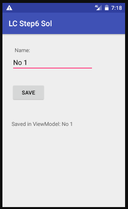

# Лабораторная работа №3. Activity Lifecycle. Alternative resources.
## Цели:
* Ознакомиться с методом обработки жизненного цикла activity/fragment при помощи Lifecycle-Aware компонентов.
* Изучить основные возможности навигации внутри приложения: создание новых activity, navigation graph.


## Задачи (19 вариант):
### Задача 1. Обработка жизненного цикла с помощью Lifecycle-Aware компонентов.
1ый и 2ой шаги codelabs чем-то напоминает предыдущую лабораторную работу. Я убедился, значение счётчика обновляется при повороте экрана в первом шаге и не обновляется во втором.

3ий шаг - после внесения требуемых изменений всё работает как и предполагается, в logcat каждую секунду выводится уведомление об апдейте таймера. Значение счётчика не не обновляется при повороте экрана.

4ый шаг - в logcat выводится информация о добавлении/удалении listener'а.

На 5ом шаге, наконец, дали задание писать код.
Первым делом, получаем экземпляр класса и привязываем его к нашему активити:


Далее, при изменеии значения слайдера изменяем значение ViewModel. В ответе есть проверка, прошло ли изменение от пользователя - у меня этой проверки нет, поскольку в этом задании других источников изменения прогресса (помимо пользователя) я не вижу.


Наконец, я создал Observer, и задал ему наблюдать за mSeekBarViewModel. В ответе предусмотрена проверка на Null, в моём решении её нет - я не вижу необходимости в ней.


На 6ом шаге требуется удостовериться, что EditText восстанавливает сохраненное значенение:


Должен обратить внимание, что во время второй проверки процесс всё ещё выводится как существующий - это не соответствует заявленному в лабораторной работе, и причина этой анамалии мне не ясна. Тем не менее, всё остальное в этом подпункте работает как положено.
Также следует отметить, что в Windows нет команды grep, поэтому я обошёлся без неё - в нашем случае она "всего лишь" выступала бы в роли фильтра.

Проблемы возникли при тестировании второй версии программы - что написанной мной, что приведенной в качестве готового решения. Она не восстанавливала сохраненное имя:




У меня нет идей, почему так происходит.

Промежуточный вывод: я познакомился с такими вещами, как Chronometer, ViewModel, ViewModelProvider, LiveData, Observer и другими. Хочется закрепить результат на практике.
Затрачно времени ~ 4 ч. 30 мин..

### Задача 2. Навигация (startActivityForResult).
Из 19 варианта следует, что мне нужно реализовать доступ к "About" через Navigation Drawer.

В данной работе я впервые встретился на практике с DrawerLayout. Как гласит официальная документация, это - контейнер, позволяющий использовать интерактивные, выезжающие из-за края экрана NavigationView. Всё остальное я помню из лабораторной работы №1.

Листинг activity_1.xml:
```
<?xml version="1.0" encoding="utf-8"?>
<androidx.drawerlayout.widget.DrawerLayout
    android:id="@+id/Drawer"
    xmlns:android="http://schemas.android.com/apk/res/android"
    xmlns:app="http://schemas.android.com/apk/res-auto"
    xmlns:tools="http://schemas.android.com/tools"
    android:layout_width="match_parent"
    android:layout_height="match_parent">

    <androidx.constraintlayout.widget.ConstraintLayout
        android:layout_width="match_parent"
        android:layout_height="match_parent">

        <Button
            android:id="@+id/button"
            android:layout_width="match_parent"
            android:layout_height="wrap_content"
            android:text="To second"
            app:layout_constraintEnd_toEndOf="parent"
            app:layout_constraintStart_toStartOf="parent"
            app:layout_constraintTop_toBottomOf="@+id/textView" />

        <TextView
            android:id="@+id/textView"
            android:layout_width="match_parent"
            android:layout_height="60dp"
            android:gravity="center"
            android:text="Activity 1"
            app:layout_constraintEnd_toEndOf="parent"
            app:layout_constraintStart_toStartOf="parent"
            app:layout_constraintTop_toTopOf="parent" />
    </androidx.constraintlayout.widget.ConstraintLayout>

    <com.google.android.material.navigation.NavigationView
        android:id="@+id/Nav"
        android:layout_gravity="start"
        android:layout_width="match_parent"
        android:layout_height="match_parent">

        <Button
            android:id="@+id/button3"
            android:layout_width="wrap_content"
            android:layout_height="wrap_content"
            android:text="About" />
    </com.google.android.material.navigation.NavigationView>

</androidx.drawerlayout.widget.DrawerLayout>
```

Листинги 1, 2 и 3 во многом схожи.

Листинг activity_2.xml:
```
<?xml version="1.0" encoding="utf-8"?>
<androidx.drawerlayout.widget.DrawerLayout
    android:id="@+id/Drawer"
    xmlns:android="http://schemas.android.com/apk/res/android"
    xmlns:app="http://schemas.android.com/apk/res-auto"
    xmlns:tools="http://schemas.android.com/tools"
    android:layout_width="match_parent"
    android:layout_height="match_parent">

    <androidx.constraintlayout.widget.ConstraintLayout
        android:layout_width="match_parent"
        android:layout_height="match_parent">

        <Button
            android:id="@+id/button"
            android:layout_width="match_parent"
            android:layout_height="wrap_content"
            android:text="To first"
            app:layout_constraintEnd_toEndOf="parent"
            app:layout_constraintStart_toStartOf="parent"
            app:layout_constraintTop_toBottomOf="@+id/textView" />

        <Button
            android:id="@+id/button2"
            android:layout_width="match_parent"
            android:layout_height="wrap_content"
            android:text="To third"
            app:layout_constraintEnd_toEndOf="parent"
            app:layout_constraintHorizontal_bias="0.0"
            app:layout_constraintStart_toStartOf="parent"
            app:layout_constraintTop_toBottomOf="@+id/button" />

        <TextView
            android:id="@+id/textView"
            android:layout_width="match_parent"
            android:layout_height="60dp"
            android:gravity="center"
            android:text="Activity 2"
            app:layout_constraintEnd_toEndOf="parent"
            app:layout_constraintStart_toStartOf="parent"
            app:layout_constraintTop_toTopOf="parent" />
    </androidx.constraintlayout.widget.ConstraintLayout>

    <com.google.android.material.navigation.NavigationView
        android:id="@+id/Nav"
        android:layout_gravity="start"
        android:layout_width="match_parent"
        android:layout_height="match_parent">

        <Button
            android:id="@+id/button3"
            android:layout_width="wrap_content"
            android:layout_height="wrap_content"
            android:text="About" />
    </com.google.android.material.navigation.NavigationView>

</androidx.drawerlayout.widget.DrawerLayout>
```

Листинг activity_3.xml:
```
<?xml version="1.0" encoding="utf-8"?>
<androidx.drawerlayout.widget.DrawerLayout
    android:id="@+id/Drawer"
    xmlns:android="http://schemas.android.com/apk/res/android"
    xmlns:app="http://schemas.android.com/apk/res-auto"
    xmlns:tools="http://schemas.android.com/tools"
    android:layout_width="match_parent"
    android:layout_height="match_parent">

    <androidx.constraintlayout.widget.ConstraintLayout
        android:layout_width="match_parent"
        android:layout_height="match_parent">

        <Button
            android:id="@+id/button"
            android:layout_width="match_parent"
            android:layout_height="wrap_content"
            android:text="To first"
            app:layout_constraintEnd_toEndOf="parent"
            app:layout_constraintStart_toStartOf="parent"
            app:layout_constraintTop_toBottomOf="@+id/textView" />

        <Button
            android:id="@+id/button2"
            android:layout_width="match_parent"
            android:layout_height="wrap_content"
            android:text="To second"
            app:layout_constraintEnd_toEndOf="parent"
            app:layout_constraintHorizontal_bias="0.0"
            app:layout_constraintStart_toStartOf="parent"
            app:layout_constraintTop_toBottomOf="@+id/button" />

        <TextView
            android:id="@+id/textView"
            android:layout_width="match_parent"
            android:layout_height="60dp"
            android:gravity="center"
            android:text="Activity 3"
            app:layout_constraintEnd_toEndOf="parent"
            app:layout_constraintStart_toStartOf="parent"
            app:layout_constraintTop_toTopOf="parent" />
    </androidx.constraintlayout.widget.ConstraintLayout>

    <com.google.android.material.navigation.NavigationView
        android:id="@+id/Nav"
        android:layout_gravity="start"
        android:layout_width="match_parent"
        android:layout_height="match_parent">

        <Button
            android:id="@+id/button3"
            android:layout_width="wrap_content"
            android:layout_height="wrap_content"
            android:text="About" />
    </com.google.android.material.navigation.NavigationView>

</androidx.drawerlayout.widget.DrawerLayout>
```

Листинг activity_about.xml:
```
<?xml version="1.0" encoding="utf-8"?>
<androidx.constraintlayout.widget.ConstraintLayout
    xmlns:android="http://schemas.android.com/apk/res/android"
    xmlns:app="http://schemas.android.com/apk/res-auto"
    xmlns:tools="http://schemas.android.com/tools"
    android:layout_width="match_parent"
    android:layout_height="match_parent">

    <TextView
        android:id="@+id/textView"
        android:layout_width="match_parent"
        android:layout_height="60dp"
        android:gravity="center"
        android:text="Activity About"
        app:layout_constraintEnd_toEndOf="parent"
        app:layout_constraintStart_toStartOf="parent"
        app:layout_constraintTop_toTopOf="parent" />

    <TextView
        android:id="@+id/textView2"
        android:layout_width="match_parent"
        android:layout_height="wrap_content"
        android:text="@string/someText"
        app:layout_constraintEnd_toEndOf="parent"
        app:layout_constraintStart_toStartOf="parent"
        app:layout_constraintTop_toBottomOf="@+id/textView" />

</androidx.constraintlayout.widget.ConstraintLayout>
```

В Activity1 есть setOnClickListener(), выполняющаяся при нажатии на кнопку; startActivity, запускающая указанную Activity; и Drawer.closeDrawer(), закрывающий NavigationView.

Листинг Activity1.kt:
```
package com.example.lab3

import android.content.Intent
import androidx.appcompat.app.AppCompatActivity
import android.os.Bundle
import android.util.Log
import android.widget.Button
import androidx.core.view.GravityCompat
import kotlinx.android.synthetic.main.activity_1.*

class Activity1 : AppCompatActivity() {
    override fun onCreate(savedInstanceState: Bundle?) {
        super.onCreate(savedInstanceState)
        setContentView(R.layout.activity_1)

        button.setOnClickListener() {
            startActivity(Intent(applicationContext, Activity2::class.java))
        }

        button3.setOnClickListener() {
            startActivity(Intent(applicationContext, ActivityAbout::class.java))
            Drawer.closeDrawer(GravityCompat.START, true)
        }
    }

}
```

Activity2 иначе реагирует на нажатия кнопок: при нажатии на "button", мы не будем создавать новую Activity1, а закроем текущую, попав на ранее открытую Activity1.
Также, здесь используется startActivityForResult(). Когда Activity3 будет закрыта, onActivityResult() обработает результат, и при необходимости (если в Activity3 была нажата кнопка "TO FIRST"), закроет текущую Activity2.

Листинг Activity2.kt:
```
package com.example.lab3

import android.content.Intent
import androidx.appcompat.app.AppCompatActivity
import android.os.Bundle
import android.widget.Button
import androidx.core.view.GravityCompat
import kotlinx.android.synthetic.main.activity_1.*
import kotlinx.android.synthetic.main.activity_1.Drawer
import kotlinx.android.synthetic.main.activity_1.button
import kotlinx.android.synthetic.main.activity_1.button3
import kotlinx.android.synthetic.main.activity_2.*

class Activity2 : AppCompatActivity() {
    override fun onCreate(savedInstanceState: Bundle?) {
        super.onCreate(savedInstanceState)
        setContentView(R.layout.activity_2)


        button.setOnClickListener() {
            finish()
        }

        button2.setOnClickListener() {
            startActivityForResult(Intent(applicationContext, Activity3::class.java), 1)
        }

        button3.setOnClickListener() {
            startActivity(Intent(applicationContext, ActivityAbout::class.java))
            Drawer.closeDrawer(GravityCompat.START, true)
        }
    }

    override fun onActivityResult(requestCode: Int, resultCode: Int, data: Intent?) {
        super.onActivityResult(requestCode, resultCode, data)
        if (resultCode == 0)
            finish()
    }
    
}
```

setResult() задаёт результат для Activity2, как я писал выше.
onBackPressed() обрабатывается, когда пользователь нажмёт на кнпоку возврата.
Весь остальной функционал я уже описал ранее.

Листинг Activity3.kt:
```
package com.example.lab3

import android.content.Intent
import androidx.appcompat.app.AppCompatActivity
import android.os.Bundle
import android.widget.Button
import androidx.core.view.GravityCompat
import kotlinx.android.synthetic.main.activity_1.*
import kotlinx.android.synthetic.main.activity_1.Drawer
import kotlinx.android.synthetic.main.activity_1.button
import kotlinx.android.synthetic.main.activity_1.button3
import kotlinx.android.synthetic.main.activity_3.*

class Activity3 : AppCompatActivity() {
    override fun onCreate(savedInstanceState: Bundle?) {
        super.onCreate(savedInstanceState)
        setContentView(R.layout.activity_3)

        button.setOnClickListener() {
            setResult(0)
            finish()
        }

        button2.setOnClickListener() {
            setResult(1)
            finish()
        }

        button3.setOnClickListener() {
            startActivity(Intent(applicationContext, ActivityAbout::class.java))
            Drawer.closeDrawer(GravityCompat.START, true)
        }
    }

    override fun onBackPressed() {
        setResult(1)
        finish()
    }

}
```

Листинг ActivityAbout.kt:
```
<?xml version="1.0" encoding="utf-8"?>
<androidx.constraintlayout.widget.ConstraintLayout
    xmlns:android="http://schemas.android.com/apk/res/android"
    xmlns:app="http://schemas.android.com/apk/res-auto"
    xmlns:tools="http://schemas.android.com/tools"
    android:layout_width="match_parent"
    android:layout_height="match_parent">

    <TextView
        android:id="@+id/textView"
        android:layout_width="match_parent"
        android:layout_height="60dp"
        android:gravity="center"
        android:text="Activity About"
        app:layout_constraintEnd_toEndOf="parent"
        app:layout_constraintStart_toStartOf="parent"
        app:layout_constraintTop_toTopOf="parent" />

    <TextView
        android:id="@+id/textView2"
        android:layout_width="match_parent"
        android:layout_height="wrap_content"
        android:text="@string/someText"
        app:layout_constraintEnd_toEndOf="parent"
        app:layout_constraintStart_toStartOf="parent"
        app:layout_constraintTop_toBottomOf="@+id/textView" />

</androidx.constraintlayout.widget.ConstraintLayout>
```

Как показало тестирование, при попытке перейти на незарегестрированную Activity приложение вылетит.

### Задача 3. Навигация (флаги Intent/атрибуты Activity).
Решим задачу №2, используя флаги Intent. Они позволяют указывать, стоит ли создавать новую Activity, или использовать ранее созданную.